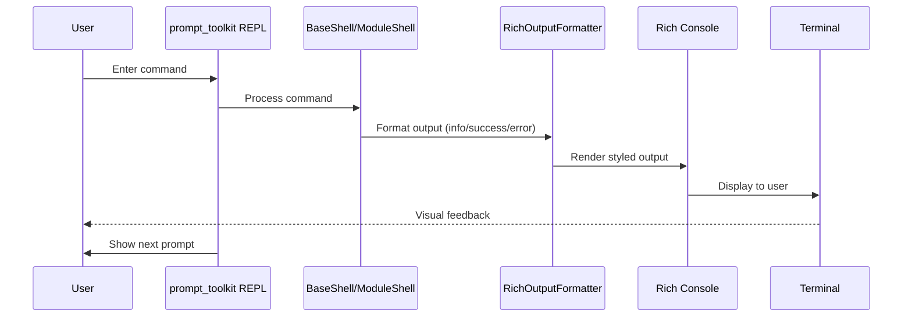

ye# Design Document: Modern CLI UI Enhancement

## Overview

This design document specifies the integration of the Rich library into the RedSploit CLI to modernize the user interface with clean, minimal aesthetics inspired by Claude Code. The enhancement maintains full backward compatibility with the existing prompt_toolkit REPL while adding sophisticated visual components including panels, tables, styled messages, and syntax highlighting.

The design follows a layered approach where Rich components wrap existing output mechanisms without disrupting the core REPL functionality. The terracotta accent color (#e05a2f) serves as the primary brand color throughout the interface, creating visual consistency with the existing prompt styling.

## Architecture

### High-Level Architecture

```
┌─────────────────────────────────────────────────────────────┐
│                    User Input Layer                          │
│              (prompt_toolkit REPL - unchanged)               │
└──────────────────────┬──────────────────────────────────────┘
                       │
┌──────────────────────▼──────────────────────────────────────┐
│                  Command Processing                          │
│         (BaseShell, ModuleShell - unchanged)                 │
└──────────────────────┬──────────────────────────────────────┘
                       │
┌──────────────────────▼──────────────────────────────────────┐
│              Output Formatting Layer (NEW)                   │
│  ┌────────────────────────────────────────────────────────┐ │
│  │           RichOutputFormatter                          │ │
│  │  - Message formatting (info, success, warn, error)    │ │
│  │  - Panel rendering                                     │ │
│  │  - Table rendering                                     │ │
│  │  - Syntax highlighting                                 │ │
│  └────────────────────────────────────────────────────────┘ │
│  ┌────────────────────────────────────────────────────────┐ │
│  │           RichTheme                                    │ │
│  │  - Color definitions                                   │ │
│  │  - Style configurations                                │ │
│  └────────────────────────────────────────────────────────┘ │
└──────────────────────┬──────────────────────────────────────┘
                       │
┌──────────────────────▼──────────────────────────────────────┐
│                Terminal Output                               │
│              (Rich Console rendering)                        │
└─────────────────────────────────────────────────────────────┘
```

### Integration Strategy

The design uses a **wrapper pattern** to integrate Rich without modifying the core REPL:

1. **Console Singleton**: A single Rich Console instance is created and reused throughout the application
2. **Backward Compatible Logging**: New Rich-based log functions maintain the same API as the existing Colors class functions
3. **Opt-in Enhancement**: Modules can gradually adopt Rich components while maintaining plain text fallbacks
4. **REPL Isolation**: Rich output occurs between REPL prompts, never interfering with input handling

### Component Interaction Flow



## Components and Interfaces

### 1. RichOutputFormatter

**Purpose**: Central component for all Rich-based output formatting

**Location**: `redsploit/core/rich_output.py`

**Interface**:

```python
class RichOutputFormatter:
    """Centralized Rich output formatting for the CLI."""
    
    def __init__(self, console: Console | None = None):
        """Initialize with optional console instance."""
        self.console = console or get_console()
    
    # Message formatting
    def info(self, message: str, **kwargs) -> None:
        """Display info message with cyan styling."""
    
    def success(self, message: str, **kwargs) -> None:
        """Display success message with green styling."""
    
    def warn(self, message: str, **kwargs) -> None:
        """Display warning message with yellow styling."""
    
    def error(self, message: str, **kwargs) -> None:
        """Display error message with red styling."""
    
    def run(self, command: str, **kwargs) -> None:
        """Display command execution with bold styling."""
    
    # Panel rendering
    def panel(
        self,
        content: str | RenderableType,
        title: str | None = None,
        border_style: str = "terracotta",
        **kwargs
    ) -> None:
        """Render content in a bordered panel."""
    
    # Table rendering
    def table(
        self,
        data: list[dict],
        columns: list[str] | None = None,
        title: str | None = None,
        **kwargs
    ) -> None:
        """Render data as a formatted table."""
    
    # Syntax highlighting
    def syntax(
        self,
        code: str,
        lexer: str = "python",
        theme: str = "monokai",
        line_numbers: bool = False,
        **kwargs
    ) -> None:
        """Render code with syntax highlighting."""
    
    # Help display
    def help_panel(
        self,
        command_name: str,
        description: str,
        usage: str,
        examples: list[str] | None = None,
        **kwargs
    ) -> None:
        """Render command help in a formatted panel."""
    
    # Error display
    def error_panel(
        self,
        error_type: str,
        message: str,
        traceback: str | None = None,
        suggestions: list[str] | None = None,
        **kwargs
    ) -> None:
        """Render error details in a formatted panel."""
```

### 2. RichTheme

**Purpose**: Centralized style and color configuration

**Location**: `redsploit/core/rich_theme.py`

**Interface**:

```python
class RichTheme:
    """Theme configuration for Rich components."""
    
    # Color definitions
    TERRACOTTA = "#e05a2f"
    SUCCESS = "#00ff00"
    WARNING = "#ffff00"
    ERROR = "#ff0000"
    INFO = "#00ffff"
    DIM = "#666666"
    
    @classmethod
    def get_theme(cls) -> Theme:
        """Get Rich Theme object with all style definitions."""
        return Theme({
            "terracotta": cls.TERRACOTTA,
            "success": cls.SUCCESS,
            "warning": cls.WARNING,
            "error": cls.ERROR,
            "info": cls.INFO,
            "dim": cls.DIM,
            "panel.border": cls.TERRACOTTA,
            "table.header": f"bold {cls.TERRACOTTA}",
            "table.row_even": "dim",
            "prompt": f"bold {cls.TERRACOTTA}",
        })
    
    @classmethod
    def get_console(cls, **kwargs) -> Console:
        """Create a Console instance with the theme applied."""
        return Console(theme=cls.get_theme(), **kwargs)
```

### 3. Console Singleton

**Purpose**: Provide a single, reusable Rich Console instance

**Location**: `redsploit/core/rich_output.py`

**Interface**:

```python
_console_instance: Console | None = None

def get_console() -> Console:
    """Get or create the global Rich Console instance."""
    global _console_instance
    if _console_instance is None:
        _console_instance = RichTheme.get_console()
    return _console_instance

def reset_console() -> None:
    """Reset the console instance (useful for testing)."""
    global _console_instance
    _console_instance = None
```

### 4. Backward Compatible Log Functions

**Purpose**: Replace Colors class log functions with Rich equivalents

**Location**: `redsploit/core/colors.py` (modified)

**Interface**:

```python
# New Rich-based implementations (backward compatible API)
def log_info(msg: str) -> None:
    """Display info message using Rich."""
    from .rich_output import get_formatter
    get_formatter().info(msg)

def log_success(msg: str) -> None:
    """Display success message using Rich."""
    from .rich_output import get_formatter
    get_formatter().success(msg)

def log_warn(msg: str) -> None:
    """Display warning message using Rich."""
    from .rich_output import get_formatter
    get_formatter().warn(msg)

def log_error(msg: str) -> None:
    """Display error message using Rich."""
    from .rich_output import get_formatter
    get_formatter().error(msg)

def log_run(cmd: str) -> None:
    """Display command execution using Rich."""
    from .rich_output import get_formatter
    get_formatter().run(cmd)
```

### 5. Enhanced Help Display

**Purpose**: Render command help with Rich panels and syntax highlighting

**Location**: `redsploit/modules/base.py` (modified)

**Implementation**:

```python
def print_tool_help(self, module_name: str, tool_name: str) -> None:
    """Print formatted help for a tool using Rich."""
    from ..core.rich_output import get_formatter
    
    tool = self.TOOLS.get(tool_name)
    if not tool:
        log_error(f"Tool '{tool_name}' not found.")
        return
    
    formatter = get_formatter()
    
    # Build help content
    content = []
    content.append(f"[bold]{tool.get('desc', '')}[/bold]\n")
    content.append(f"Binary: {tool.get('binary', 'built-in')}")
    
    reqs = tool.get("requires", [])
    if reqs:
        content.append(f"Session inputs: {', '.join(reqs)}")
    
    # Render in panel
    formatter.panel(
        "\n".join(content),
        title=f"[bold terracotta]{tool_name}[/bold terracotta]",
        border_style="terracotta"
    )
    
    # Show examples with syntax highlighting
    examples = self._tool_examples(module_name, tool_name, tool)
    if examples:
        formatter.console.print("\n[bold]Examples:[/bold]")
        for example in examples:
            formatter.syntax(example, lexer="bash", line_numbers=False)
```

### 6. Table-Based Data Display

**Purpose**: Render structured data (options, configs, loot) as tables

**Location**: Various modules (session.py, base_shell.py)

**Implementation Example**:

```python
def show_options(self, all_vars: bool = False) -> None:
    """Display session options using Rich table."""
    from .rich_output import get_formatter
    
    formatter = get_formatter()
    
    # Prepare table data
    data = []
    for key, value in self.env.items():
        if not all_vars and not value:
            continue
        meta = self.VAR_METADATA.get(key, {})
        data.append({
            "Variable": key,
            "Value": value or "[dim](not set)[/dim]",
            "Description": meta.get("desc", "")
        })
    
    # Render table
    formatter.table(
        data,
        title="Session Options",
        columns=["Variable", "Value", "Description"]
    )
```

### 7. Workflow Output Enhancement

**Purpose**: Format workflow execution output with Rich components

**Location**: `redsploit/workflow/execution.py` (modified)

**Implementation**:

```python
def display_workflow_start(self, workflow_name: str, target: str) -> None:
    """Display workflow start panel."""
    from ..core.rich_output import get_formatter
    
    formatter = get_formatter()
    content = f"Target: [bold]{target}[/bold]\nWorkflow: {workflow_name}"
    formatter.panel(content, title="Workflow Execution", border_style="terracotta")

def display_workflow_findings(self, findings: list[dict]) -> None:
    """Display findings as a Rich table."""
    from ..core.rich_output import get_formatter
    
    formatter = get_formatter()
    
    # Add severity colors
    for finding in findings:
        severity = finding.get("severity", "info")
        if severity == "critical":
            finding["severity"] = "[red bold]CRITICAL[/red bold]"
        elif severity == "high":
            finding["severity"] = "[red]HIGH[/red]"
        elif severity == "medium":
            finding["severity"] = "[yellow]MEDIUM[/yellow]"
        else:
            finding["severity"] = "[dim]INFO[/dim]"
    
    formatter.table(findings, title="Workflow Findings")
```

## Data Models

### RichOutputFormatter Configuration

```python
@dataclass
class FormatterConfig:
    """Configuration for RichOutputFormatter."""
    
    # Console settings
    force_terminal: bool = True
    force_interactive: bool = False
    width: int | None = None
    
    # Message settings
    show_icons: bool = True
    icon_info: str = "[*]"
    icon_success: str = "[+]"
    icon_warn: str = "[!]"
    icon_error: str = "[-]"
    icon_run: str = "[>]"
    
    # Panel settings
    default_border_style: str = "terracotta"
    panel_padding: tuple[int, int] = (0, 1)
    
    # Table settings
    table_show_header: bool = True
    table_show_lines: bool = False
    table_row_styles: list[str] = field(default_factory=lambda: ["", "dim"])
    
    # Performance settings
    max_table_rows: int = 1000
    truncate_long_values: bool = True
    max_value_length: int = 100
```

### Theme Style Definitions

```python
THEME_STYLES = {
    # Base colors
    "terracotta": "#e05a2f",
    "success": "#00ff00",
    "warning": "#ffff00",
    "error": "#ff0000",
    "info": "#00ffff",
    "dim": "#666666",
    
    # Component styles
    "panel.border": "#e05a2f",
    "panel.title": "bold #e05a2f",
    
    "table.header": "bold #e05a2f",
    "table.row_even": "dim",
    "table.border": "#e05a2f",
    
    "syntax.keyword": "bold #e05a2f",
    "syntax.string": "#00ff00",
    "syntax.comment": "dim",
    
    # Message styles
    "msg.info": "#00ffff",
    "msg.success": "#00ff00",
    "msg.warning": "#ffff00",
    "msg.error": "#ff0000",
    "msg.run": "bold",
}
```

## Correctness Properties

*A property is a characteristic or behavior that should hold true across all valid executions of a system—essentially, a formal statement about what the system should do. Properties serve as the bridge between human-readable specifications and machine-verifiable correctness guarantees.*

### Property 1: Console Singleton Consistency

*For any* sequence of calls to `get_console()`, the function SHALL return the same Console instance throughout the application lifecycle.

**Validates: Requirements 1.1, 1.4**

### Property 2: Output Non-Interference

*For any* Rich output operation, the operation SHALL complete without blocking or interfering with prompt_toolkit's input handling.

**Validates: Requirements 1.5, 12.2**

### Property 3: Backward Compatible API

*For any* existing call to `log_info()`, `log_success()`, `log_warn()`, `log_error()`, or `log_run()`, the function SHALL produce styled output without requiring changes to the calling code.

**Validates: Requirements 2.5, 11.1**

### Property 4: Theme Consistency

*For any* Rich component rendered (Panel, Table, Syntax), the component SHALL use colors and styles defined in the RichTheme configuration.

**Validates: Requirements 1.2, 10.1, 10.2**

### Property 5: Graceful Degradation

*For any* Rich rendering operation that fails, the system SHALL fall back to plain text output without crashing.

**Validates: Requirements 11.4**

### Property 6: Panel Border Styling

*For any* Panel rendered with default settings, the Panel SHALL use the terracotta accent color (#e05a2f) for its border.

**Validates: Requirements 3.3, 10.3**

### Property 7: Table Column Alignment

*For any* Table rendered with data, numeric columns SHALL be right-aligned and text columns SHALL be left-aligned.

**Validates: Requirements 4.4**

### Property 8: Message Icon Consistency

*For any* message type (info, success, warn, error), the formatted output SHALL include the appropriate icon prefix.

**Validates: Requirements 2.1, 2.2, 2.3, 2.4**

### Property 9: Help Panel Structure

*For any* command help display, the output SHALL include a Panel with title, description, usage, and examples sections.

**Validates: Requirements 3.1, 3.2, 3.4**

### Property 10: Syntax Highlighting Application

*For any* code example in help display, the code SHALL be rendered with syntax highlighting appropriate to its language.

**Validates: Requirements 3.5**

### Property 11: Table Empty State

*For any* Table rendered with empty data, the output SHALL display a styled message indicating no data is available.

**Validates: Requirements 4.5**

### Property 12: Error Panel Completeness

*For any* exception display, the Error Panel SHALL include error type, message, and (when available) traceback information.

**Validates: Requirements 7.1, 7.2, 7.3**

### Property 13: Performance Threshold

*For any* typical output operation (message, panel, or table with < 100 rows), the rendering time SHALL be less than 100 milliseconds.

**Validates: Requirements 12.1**

### Property 14: REPL Command Preservation

*For any* command entered in the REPL before Rich integration, the command SHALL execute with identical behavior after Rich integration.

**Validates: Requirements 11.1, 11.2**

### Property 15: Module Context Display

*For any* module entry, the CLI SHALL display module information in a Panel with the module name as title.

**Validates: Requirements 5.1, 5.2**

## Error Handling

### Error Categories

1. **Rich Rendering Errors**: Failures in Rich component rendering
2. **Console Initialization Errors**: Failures creating the Console instance
3. **Theme Loading Errors**: Failures loading or applying the theme
4. **Terminal Compatibility Errors**: Issues with terminal capabilities

### Error Handling Strategy

```python
class RichOutputError(Exception):
    """Base exception for Rich output errors."""
    pass

class ConsoleInitError(RichOutputError):
    """Failed to initialize Rich Console."""
    pass

class RenderingError(RichOutputError):
    """Failed to render Rich component."""
    pass

def safe_render(render_func):
    """Decorator for safe Rich rendering with fallback."""
    def wrapper(*args, **kwargs):
        try:
            return render_func(*args, **kwargs)
        except Exception as e:
            # Log error and fall back to plain text
            import sys
            print(f"[Rendering error: {e}]", file=sys.stderr)
            # Extract plain text from args if possible
            if args and isinstance(args[0], str):
                print(args[0])
    return wrapper
```

### Fallback Mechanisms

1. **Console Creation Fallback**: If Rich Console fails to initialize, create a minimal Console with no theme
2. **Rendering Fallback**: If Rich rendering fails, output plain text version
3. **Theme Fallback**: If custom theme fails to load, use Rich default theme
4. **Terminal Detection**: Detect terminal capabilities and disable Rich features if unsupported

### Error Messages

```python
ERROR_MESSAGES = {
    "console_init": "Failed to initialize Rich console. Using plain text output.",
    "theme_load": "Failed to load custom theme. Using default theme.",
    "render_panel": "Failed to render panel. Displaying plain text.",
    "render_table": "Failed to render table. Displaying plain text.",
    "syntax_highlight": "Failed to apply syntax highlighting. Displaying plain code.",
}
```

## Testing Strategy

### Unit Testing

**Focus**: Individual component functionality

**Test Cases**:

1. **RichOutputFormatter Tests**:
   - Test each message type (info, success, warn, error) produces correct styling
   - Test panel rendering with various content types
   - Test table rendering with different data structures
   - Test syntax highlighting with multiple languages
   - Test help panel formatting
   - Test error panel formatting

2. **RichTheme Tests**:
   - Test theme creation with all required styles
   - Test color definitions match specifications
   - Test console creation with theme applied

3. **Console Singleton Tests**:
   - Test `get_console()` returns same instance on multiple calls
   - Test `reset_console()` clears the instance
   - Test console initialization with custom settings

4. **Backward Compatibility Tests**:
   - Test `log_info()`, `log_success()`, `log_warn()`, `log_error()`, `log_run()` produce output
   - Test existing code calling these functions works unchanged

5. **Error Handling Tests**:
   - Test fallback to plain text when Rich rendering fails
   - Test error messages are displayed correctly
   - Test graceful degradation with unsupported terminals

### Integration Testing

**Focus**: Component interaction and REPL integration

**Test Cases**:

1. **REPL Integration Tests**:
   - Test Rich output doesn't interfere with prompt_toolkit input
   - Test output appears between prompts correctly
   - Test command history works with Rich output
   - Test auto-completion works with Rich output

2. **Module Integration Tests**:
   - Test help display in module shells
   - Test tool output formatting
   - Test session options display as table
   - Test loot display as table

3. **Workflow Integration Tests**:
   - Test workflow start panel display
   - Test workflow progress formatting
   - Test workflow findings table display
   - Test workflow summary panel

4. **End-to-End Tests**:
   - Test complete user session with Rich output
   - Test switching between modules with Rich output
   - Test error scenarios with Rich error panels
   - Test command suggestions with Rich formatting

### Property-Based Testing

**Not applicable** for this feature. The UI enhancement involves rendering and visual presentation, which are not suitable for property-based testing. Instead, we rely on:

- **Snapshot tests** for visual regression testing
- **Example-based unit tests** for component behavior
- **Integration tests** for REPL interaction

### Manual Testing Checklist

1. **Visual Verification**:
   - [ ] Terracotta accent color appears correctly in all components
   - [ ] Panels have clean borders and appropriate spacing
   - [ ] Tables are properly aligned and readable
   - [ ] Syntax highlighting uses appropriate colors
   - [ ] Error panels are visually distinct

2. **REPL Interaction**:
   - [ ] Input prompt appears correctly after Rich output
   - [ ] Command completion works during and after Rich output
   - [ ] Command history navigation works correctly
   - [ ] Ctrl+C interrupts work correctly

3. **Performance**:
   - [ ] No noticeable delay in output rendering
   - [ ] Large tables render without blocking
   - [ ] Workflow output streams smoothly

4. **Compatibility**:
   - [ ] Works in standard terminal emulators (iTerm2, Terminal.app, GNOME Terminal)
   - [ ] Falls back gracefully in limited terminals
   - [ ] Works over SSH connections

### Test Configuration

```python
# pytest configuration for Rich testing
pytest_plugins = ["pytest_rich"]

@pytest.fixture
def rich_console():
    """Provide a Rich console for testing."""
    from redsploit.core.rich_output import reset_console, get_console
    reset_console()
    console = get_console()
    yield console
    reset_console()

@pytest.fixture
def rich_formatter():
    """Provide a RichOutputFormatter for testing."""
    from redsploit.core.rich_output import RichOutputFormatter, reset_console
    reset_console()
    formatter = RichOutputFormatter()
    yield formatter
    reset_console()
```

### Coverage Goals

- **Unit Test Coverage**: > 90% for new Rich components
- **Integration Test Coverage**: > 80% for modified existing components
- **Manual Test Coverage**: 100% of visual elements verified

## Implementation Notes

### Phase 1: Foundation (Core Components)

1. Create `redsploit/core/rich_theme.py` with theme definitions
2. Create `redsploit/core/rich_output.py` with RichOutputFormatter and console singleton
3. Update `redsploit/core/colors.py` to use Rich-based log functions
4. Add Rich dependency to `pyproject.toml`

### Phase 2: Basic Integration (Messages and Panels)

1. Update all existing `log_*()` calls to use new Rich-based functions (no code changes needed due to backward compatibility)
2. Add panel rendering to module entry points (preloop in ModuleShell)
3. Add panel rendering to help displays

### Phase 3: Structured Data (Tables)

1. Update `Session.show_options()` to use Rich tables
2. Update loot display to use Rich tables
3. Update workspace list to use Rich tables
4. Update tool configuration display to use Rich tables

### Phase 4: Advanced Features (Syntax and Errors)

1. Add syntax highlighting to help examples
2. Add Rich error panels for exception handling
3. Add Rich formatting to command suggestions
4. Add Rich formatting to workflow output

### Phase 5: Polish and Optimization

1. Performance profiling and optimization
2. Terminal compatibility testing
3. Visual refinement and spacing adjustments
4. Documentation and examples

### Dependencies

```toml
[tool.poetry.dependencies]
rich = "^13.7.0"  # Rich library for terminal formatting
```

### Configuration Options

Add to `config.yaml`:

```yaml
ui:
  rich_enabled: true  # Enable/disable Rich formatting globally
  theme: "default"    # Theme name (default uses terracotta)
  force_color: false  # Force color output even if terminal doesn't support it
  max_table_rows: 1000  # Maximum rows to display in tables
  panel_padding: 1    # Padding inside panels
  show_icons: true    # Show icons in messages
```

### Migration Path

1. **Phase 1**: Rich components available but opt-in
2. **Phase 2**: Rich enabled by default with fallback
3. **Phase 3**: All output uses Rich (plain text fallback remains)

### Backward Compatibility Guarantees

1. All existing commands work unchanged
2. All existing command-line flags work unchanged
3. All existing module functionality preserved
4. Plain text fallback always available
5. Can disable Rich via configuration

---

**Design Status**: Ready for implementation
**Last Updated**: 2024
**Reviewed By**: Pending

