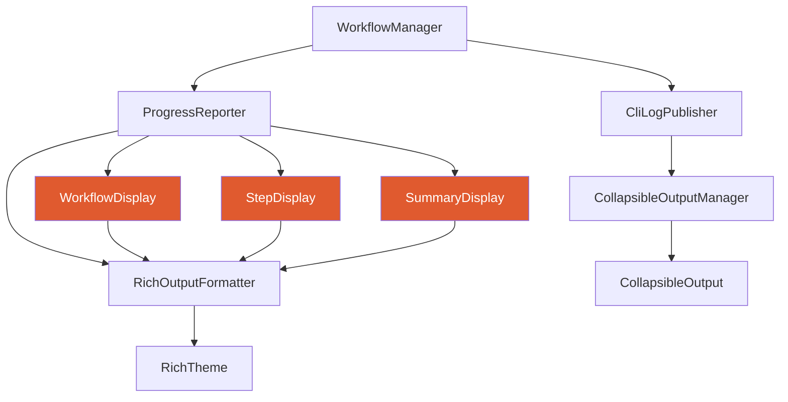
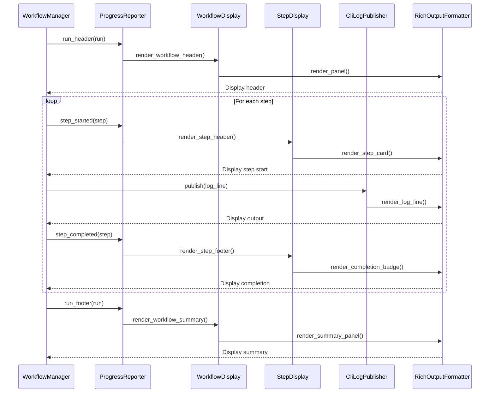

# Design Document: TUI Redesign

## Overview

The RedSploit CLI Terminal User Interface (TUI) redesign aims to modernize the workflow execution output with improved visual hierarchy, cleaner progress indicators, better color schemes, and enhanced readability. The current implementation uses a mix of ANSI colors, Rich library panels, and collapsible output, but suffers from visual clutter, inconsistent spacing, and poor information hierarchy. This redesign will create a cohesive, modern terminal experience that makes workflow execution easier to follow and understand.

The redesign focuses on three core areas: (1) streamlined workflow execution display with progressive disclosure, (2) unified component styling with consistent visual language, and (3) improved status indicators and progress feedback. The solution leverages the existing Rich library infrastructure while introducing new layout patterns and visual components.

## Architecture



## Sequence Diagrams

### Workflow Execution Flow



## Components and Interfaces

### Component 1: WorkflowDisplay

**Purpose**: Manages the overall workflow execution display including header, progress overview, and summary.

**Interface**:
```python
class WorkflowDisplay:
    """Renders workflow-level UI components."""
    
    def __init__(self, formatter: RichOutputFormatter, theme: DisplayTheme):
        """Initialize workflow display with formatter and theme."""
        pass
    
    def render_header(self, run: WorkflowRun) -> None:
        """Render workflow execution header with metadata."""
        pass
    
    def render_progress_bar(self, run: WorkflowRun) -> None:
        """Render overall workflow progress bar."""
        pass
    
    def render_summary(self, run: WorkflowRun) -> None:
        """Render workflow completion summary with statistics."""
        pass
    
    def render_step_overview(self, steps: list[Step]) -> None:
        """Render compact step status overview."""
        pass
```

**Responsibilities**:
- Render workflow header with target, mode, profile information
- Display overall progress bar showing completion percentage
- Render final summary with statistics and timing
- Provide compact step overview for quick status scanning

### Component 2: StepDisplay

**Purpose**: Handles individual step rendering including headers, output, and completion status.

**Interface**:
```python
class StepDisplay:
    """Renders step-level UI components."""
    
    def __init__(self, formatter: RichOutputFormatter, theme: DisplayTheme):
        """Initialize step display with formatter and theme."""
        pass
    
    def render_step_header(self, step: Step) -> None:
        """Render step start header with tool and metadata."""
        pass
    
    def render_step_footer(self, step: Step) -> None:
        """Render step completion footer with timing and output count."""
        pass
    
    def render_output_line(self, line: str, level: str = "info") -> None:
        """Render a single output line with appropriate styling."""
        pass
    
    def render_error_details(self, step: Step) -> None:
        """Render detailed error information for failed steps."""
        pass
    
    def render_truncation_notice(self, hidden_lines: int, step_id: str) -> None:
        """Render output truncation notice with expansion hint."""
        pass
```

**Responsibilities**:
- Render step start cards with tool name and configuration
- Display step output with syntax highlighting and log levels
- Show completion badges with timing and output statistics
- Render error details with context and suggestions
- Display truncation notices with keyboard shortcuts

### Component 3: DisplayTheme

**Purpose**: Centralized theme configuration for all TUI components with consistent visual language.

**Interface**:
```python
@dataclass
class DisplayTheme:
    """Theme configuration for TUI components."""
    
    # Colors
    primary: str = "#e05a2f"  # Terracotta
    success: str = "#00ff00"
    warning: str = "#ffff00"
    error: str = "#ff0000"
    info: str = "#00ffff"
    dim: str = "#666666"
    
    # Icons
    icon_running: str = "▶"
    icon_complete: str = "✓"
    icon_failed: str = "✗"
    icon_skipped: str = "–"
    icon_pending: str = "○"
    
    # Layout
    panel_padding: tuple[int, int] = (0, 2)
    separator_char: str = "─"
    separator_width: int = 80
    indent_size: int = 2
    
    # Progress bar
    progress_bar_width: int = 40
    progress_complete_char: str = "█"
    progress_incomplete_char: str = "░"
    
    def get_status_icon(self, status: str) -> str:
        """Get icon for step status."""
        pass
    
    def get_status_color(self, status: str) -> str:
        """Get color for step status."""
        pass
```

**Responsibilities**:
- Define all colors, icons, and layout constants
- Provide consistent visual language across components
- Support theme customization through configuration
- Map status values to visual representations

### Component 4: ProgressReporter (Enhanced)

**Purpose**: Orchestrates TUI rendering during workflow execution with improved visual feedback.

**Interface**:
```python
class ProgressReporter:
    """Enhanced progress reporter with modern TUI components."""
    
    def __init__(self, theme: DisplayTheme | None = None):
        """Initialize with optional custom theme."""
        pass
    
    def run_header(self, run: WorkflowRun) -> None:
        """Display workflow start with header and progress bar."""
        pass
    
    def step_started(self, run: WorkflowRun, step: Step, publisher: CliLogPublisher | None = None) -> None:
        """Display step start with card layout."""
        pass
    
    def step_completed(self, step: Step) -> None:
        """Display step completion with badge and statistics."""
        pass
    
    def step_failed(self, step: Step) -> None:
        """Display step failure with error details."""
        pass
    
    def step_skipped(self, step: Step) -> None:
        """Display skipped step with dim styling."""
        pass
    
    def run_footer(self, run: WorkflowRun) -> None:
        """Display workflow completion summary."""
        pass
    
    def update_progress(self, run: WorkflowRun) -> None:
        """Update overall progress bar (optional live updates)."""
        pass
```

**Responsibilities**:
- Orchestrate workflow and step display components
- Manage timing and statistics tracking
- Coordinate with CliLogPublisher for output streaming
- Provide live progress updates (optional)

## Data Models

### Model 1: DisplayTheme

```python
@dataclass
class DisplayTheme:
    """Theme configuration for TUI display."""
    
    # Color palette
    primary: str
    success: str
    warning: str
    error: str
    info: str
    dim: str
    
    # Status icons
    icon_running: str
    icon_complete: str
    icon_failed: str
    icon_skipped: str
    icon_pending: str
    
    # Layout configuration
    panel_padding: tuple[int, int]
    separator_char: str
    separator_width: int
    indent_size: int
    
    # Progress bar configuration
    progress_bar_width: int
    progress_complete_char: str
    progress_incomplete_char: str
```

**Validation Rules**:
- All color values must be valid hex colors or ANSI color names
- Icon strings must be single characters or valid Unicode symbols
- Layout dimensions must be positive integers
- Progress bar width must be between 20 and 100

### Model 2: StepDisplayState

```python
@dataclass
class StepDisplayState:
    """Tracks display state for a step during execution."""
    
    step_id: str
    start_time: float
    output_lines_shown: int
    output_lines_total: int
    is_truncated: bool
    last_update: float
    status: str  # "running", "complete", "failed", "skipped"
```

**Validation Rules**:
- step_id must be non-empty string
- start_time must be valid timestamp
- output_lines_shown <= output_lines_total
- status must be one of valid status values

## Algorithmic Pseudocode

### Main Workflow Display Algorithm

```python
def render_workflow_execution(run: WorkflowRun, publisher: CliLogPublisher) -> None:
    """
    Main algorithm for rendering workflow execution with modern TUI.
    
    Preconditions:
    - run is a valid WorkflowRun object with steps
    - publisher is initialized CliLogPublisher
    - Rich console is available and configured
    
    Postconditions:
    - Complete workflow execution is rendered to terminal
    - All steps are displayed with appropriate status
    - Summary statistics are shown at completion
    
    Loop Invariants:
    - All previously completed steps remain in valid display state
    - Progress bar accurately reflects completion percentage
    - Display state is consistent with run state
    """
    
    # Initialize display components
    theme = DisplayTheme()
    formatter = get_formatter()
    workflow_display = WorkflowDisplay(formatter, theme)
    step_display = StepDisplay(formatter, theme)
    
    # Render workflow header
    workflow_display.render_header(run)
    workflow_display.render_progress_bar(run)
    
    # Track display state
    step_states: dict[str, StepDisplayState] = {}
    
    # Process each step
    for step in run.steps:
        # Initialize step state
        step_states[step.id] = StepDisplayState(
            step_id=step.id,
            start_time=time.time(),
            output_lines_shown=0,
            output_lines_total=0,
            is_truncated=False,
            last_update=time.time(),
            status="running"
        )
        
        # Render step start
        step_display.render_step_header(step)
        
        # Stream output with truncation
        output_manager = publisher.get_or_create(step.id)
        while step.status == "running":
            # Output is streamed by publisher in real-time
            # CollapsibleOutput handles truncation automatically
            pass
        
        # Render step completion
        if step.status == "complete":
            step_display.render_step_footer(step)
        elif step.status == "failed":
            step_display.render_error_details(step)
        elif step.status == "skipped":
            step_display.render_step_footer(step)
        
        # Update progress bar
        workflow_display.render_progress_bar(run)
    
    # Render final summary
    workflow_display.render_summary(run)
```

### Step Card Rendering Algorithm

```python
def render_step_card(step: Step, theme: DisplayTheme, formatter: RichOutputFormatter) -> None:
    """
    Render a step start card with modern card-based layout.
    
    Preconditions:
    - step is valid Step object with id and tool
    - theme is initialized DisplayTheme
    - formatter is initialized RichOutputFormatter
    
    Postconditions:
    - Step card is rendered to terminal
    - Card includes step ID, tool name, and metadata
    - Visual separator is added for clarity
    
    Loop Invariants: N/A (no loops)
    """
    
    # Build card content
    icon = theme.icon_running
    tool_name = step.tool or step.kind
    
    # Create card header
    header = f"{icon} {step.id}"
    subheader = f"Tool: {tool_name}"
    
    # Add metadata if available
    metadata_parts = []
    if step.config:
        for key, value in step.config.items():
            metadata_parts.append(f"{key}={value}")
    
    metadata = " · ".join(metadata_parts) if metadata_parts else ""
    
    # Render card using Rich panel
    content_lines = [
        f"[bold]{header}[/bold]",
        f"[dim]{subheader}[/dim]"
    ]
    
    if metadata:
        content_lines.append(f"[dim]{metadata}[/dim]")
    
    formatter.panel(
        "\n".join(content_lines),
        border_style="info",
        padding=theme.panel_padding
    )
```

### Progress Bar Rendering Algorithm

```python
def render_progress_bar(run: WorkflowRun, theme: DisplayTheme, formatter: RichOutputFormatter) -> None:
    """
    Render workflow progress bar with completion percentage.
    
    Preconditions:
    - run is valid WorkflowRun with steps
    - theme is initialized DisplayTheme
    - formatter is initialized RichOutputFormatter
    - len(run.steps) > 0
    
    Postconditions:
    - Progress bar is rendered showing completion percentage
    - Bar uses theme colors and characters
    - Percentage text is displayed alongside bar
    
    Loop Invariants:
    - completed_count <= total_count throughout calculation
    """
    
    # Calculate completion
    total_count = len(run.steps)
    completed_count = sum(1 for s in run.steps if s.status in {"complete", "failed", "skipped"})
    percentage = (completed_count / total_count) * 100 if total_count > 0 else 0
    
    # Calculate bar fill
    bar_width = theme.progress_bar_width
    filled_width = int((completed_count / total_count) * bar_width) if total_count > 0 else 0
    empty_width = bar_width - filled_width
    
    # Build progress bar
    filled_bar = theme.progress_complete_char * filled_width
    empty_bar = theme.progress_incomplete_char * empty_width
    progress_bar = f"{filled_bar}{empty_bar}"
    
    # Render with percentage
    progress_text = f"[{progress_bar}] {percentage:.0f}% ({completed_count}/{total_count})"
    
    formatter.console.print(f"[dim]{progress_text}[/dim]")
```

## Key Functions with Formal Specifications

### Function 1: render_step_header()

```python
def render_step_header(step: Step, theme: DisplayTheme, formatter: RichOutputFormatter) -> None:
    """Render step start header with card layout."""
    pass
```

**Preconditions:**
- `step` is non-null Step object with valid id and tool
- `theme` is initialized DisplayTheme with valid configuration
- `formatter` is initialized RichOutputFormatter with console
- Rich console is available and supports ANSI colors

**Postconditions:**
- Step header is rendered to stderr
- Header includes step ID, tool name, and icon
- Visual separator is added for clarity
- No exceptions are raised
- Terminal cursor is positioned for output streaming

**Loop Invariants:** N/A (no loops in this function)

### Function 2: render_workflow_summary()

```python
def render_workflow_summary(run: WorkflowRun, theme: DisplayTheme, formatter: RichOutputFormatter) -> None:
    """Render workflow completion summary with statistics."""
    pass
```

**Preconditions:**
- `run` is non-null WorkflowRun with completed execution
- `run.status` is one of {"complete", "failed"}
- `run.steps` is non-empty list
- `theme` is initialized DisplayTheme
- `formatter` is initialized RichOutputFormatter

**Postconditions:**
- Summary panel is rendered to stderr
- Panel includes completion status, statistics, and timing
- Status color matches run.status (success/error)
- All step counts are accurate (complete + failed + skipped = total)
- Duration is formatted as MM:SS

**Loop Invariants:**
- When counting steps: all counted steps have valid status
- Sum of status counts never exceeds total step count

### Function 3: stream_output_with_truncation()

```python
def stream_output_with_truncation(
    step_id: str,
    output_line: str,
    max_lines: int,
    output_manager: CollapsibleOutputManager,
    formatter: RichOutputFormatter
) -> None:
    """Stream output line with automatic truncation."""
    pass
```

**Preconditions:**
- `step_id` is non-empty string
- `output_line` is valid string (may be empty)
- `max_lines` is positive integer
- `output_manager` is initialized CollapsibleOutputManager
- `formatter` is initialized RichOutputFormatter

**Postconditions:**
- Output line is added to buffer
- Line is displayed if under max_lines threshold
- Truncation notice is shown if threshold exceeded
- Line count is incremented
- No data loss (all lines buffered even if not displayed)

**Loop Invariants:** N/A (no loops in this function)

## Example Usage

```python
# Example 1: Initialize TUI components with custom theme
theme = DisplayTheme(
    primary="#e05a2f",
    progress_bar_width=50,
    separator_width=100
)

formatter = get_formatter()
workflow_display = WorkflowDisplay(formatter, theme)
step_display = StepDisplay(formatter, theme)

# Example 2: Render workflow execution
run = WorkflowRun(
    id="scan-abc123",
    workflow_name="external-project",
    target_name="example.com",
    mode="scan",
    profile="default",
    steps=[...]
)

# Render header
workflow_display.render_header(run)
workflow_display.render_progress_bar(run)

# Render each step
for step in run.steps:
    step_display.render_step_header(step)
    
    # Execute step (output streamed automatically)
    execute_step(step)
    
    # Render completion
    if step.status == "complete":
        step_display.render_step_footer(step)
    elif step.status == "failed":
        step_display.render_error_details(step)
    
    # Update progress
    workflow_display.render_progress_bar(run)

# Render summary
workflow_display.render_summary(run)

# Example 3: Custom output styling
step_display.render_output_line(
    "[INFO] Starting scan...",
    level="info"
)

step_display.render_output_line(
    "[WARN] Rate limit approaching",
    level="warning"
)

step_display.render_output_line(
    "[ERROR] Connection timeout",
    level="error"
)

# Example 4: Error details rendering
failed_step = Step(
    id="nuclei-scan",
    status="failed",
    error_summary="Connection refused",
    telemetry=StepTelemetry(duration_ms=5000)
)

step_display.render_error_details(failed_step)
```

## Correctness Properties

*A property is a characteristic or behavior that should hold true across all valid executions of a system—essentially, a formal statement about what the system should do. Properties serve as the bridge between human-readable specifications and machine-verifiable correctness guarantees.*

### Property 1: Progress Bar Accuracy

*For any* workflow run, the progress bar percentage is always between 0 and 100 inclusive, the completed step count never exceeds total step count, and 100% completion implies all steps have terminal status.

**Validates: Requirements 2.2, 2.4, 13.1, 13.2, 13.3**

### Property 2: Step Display Consistency

*For any* step and its corresponding display state, the display status matches the step execution status, displayed output line count never exceeds total output lines, and truncation flag implies output exceeds the maximum line limit.

**Validates: Requirements 14.1, 14.2, 14.3**

### Property 3: Visual Hierarchy Preservation

*For any* TUI component rendering operation, the component uses theme colors consistently, maintains proper indentation according to theme configuration, includes visual separators between sections, and applies status-appropriate styling.

**Validates: Requirements 10.1, 10.2, 10.3, 10.4, 10.5**

### Property 4: Output Truncation Safety

*For any* step output, all received lines are buffered regardless of truncation, the line count equals actual lines received, full output retrieval contains all buffered lines, and truncation for display preserves all lines in the buffer.

**Validates: Requirements 5.2, 15.1, 15.2, 15.3, 15.4**

### Property 5: Theme Consistency

*For any* theme configuration and status value, the theme provides non-null status icons and colors for all valid statuses, and all returned colors are valid color values.

**Validates: Requirements 9.5, 9.6**

### Property 6: Progress Bar Rendering

*For any* workflow run, the progress bar displays the correct ratio of completed steps to total steps, uses theme-configured progress characters, and has width matching theme configuration.

**Validates: Requirements 2.2, 2.3, 2.6, 2.7**

### Property 7: Step Card Content

*For any* step, the rendered step card includes the step ID and tool name, displays a running status icon from the theme, and includes configuration key-value pairs when configuration is available.

**Validates: Requirements 3.2, 3.3, 3.4**

### Property 8: Output Line Styling

*For any* output line with a log level, the rendered output applies appropriate styling based on the log level (info, warning, error).

**Validates: Requirements 4.2**

### Property 9: Truncation Behavior

*For any* step output exceeding the maximum preview line limit, the output is truncated for display, a truncation notice is rendered, and the notice displays the correct number of hidden lines.

**Validates: Requirements 5.1, 5.3, 5.4**

### Property 10: Step Completion Display

*For any* completed step, the completion footer includes step duration formatted as MM:SS, includes output line count, and uses the success status icon from the theme.

**Validates: Requirements 6.2, 6.3, 6.4**

### Property 11: Error Display

*For any* failed step, the error details panel includes the error summary, includes step duration, uses the theme error color, and uses the failed status icon from the theme.

**Validates: Requirements 7.2, 7.3, 7.4, 7.5**

### Property 12: Workflow Summary Content

*For any* completed workflow, the summary panel includes workflow completion status, counts of completed/failed/skipped steps, total duration formatted as MM:SS, and the sum of step counts equals total step count.

**Validates: Requirements 8.2, 8.3, 8.4, 8.7**

### Property 13: Summary Color Usage

*For any* completed workflow, the summary panel uses success color when workflow completes successfully and uses error color when workflow fails.

**Validates: Requirements 8.5, 8.6**

### Property 14: Theme Application

*For any* workflow header, the header panel uses the theme primary color and applies theme-configured padding.

**Validates: Requirements 1.3, 1.4**

### Property 15: Output Buffer Integrity

*For any* output line added to the buffer, the line is buffered and retrievable regardless of whether it's displayed or truncated.

**Validates: Requirements 4.4, 5.2**

### Property 16: Configuration Limits

*For any* configurable limit (max preview lines, buffer limit), the system respects the configured value and applies it consistently.

**Validates: Requirements 5.6, 17.4**

### Property 17: Security Sanitization

*For any* tool output containing ANSI control sequences or potential injection attacks, the system escapes or sanitizes the output before display.

**Validates: Requirements 18.1, 18.2**

## Error Handling

### Error Scenario 1: Rich Console Unavailable

**Condition**: Rich library fails to initialize or terminal doesn't support ANSI colors
**Response**: Fall back to plain text output with basic formatting
**Recovery**: 
- Detect Rich initialization failure in get_formatter()
- Use plain text fallback in RichOutputFormatter
- Disable panels, use simple separators
- Maintain information hierarchy with indentation

### Error Scenario 2: Invalid Theme Configuration

**Condition**: Theme configuration contains invalid colors or dimensions
**Response**: Use default theme values for invalid fields
**Recovery**:
- Validate theme configuration on initialization
- Replace invalid values with defaults
- Log warning about invalid configuration
- Continue execution with valid theme

### Error Scenario 3: Output Streaming Failure

**Condition**: CollapsibleOutput fails to buffer or display output
**Response**: Fall back to direct stderr printing
**Recovery**:
- Catch exceptions in publish() method
- Print directly to stderr without buffering
- Disable truncation features
- Continue workflow execution

### Error Scenario 4: Progress Calculation Error

**Condition**: Invalid step counts or division by zero in progress calculation
**Response**: Display 0% progress or skip progress bar
**Recovery**:
- Add zero-division checks in render_progress_bar()
- Validate step counts before calculation
- Display "N/A" for invalid progress
- Continue with other display elements

## Testing Strategy

### Unit Testing Approach

**Test Coverage Goals**: 90%+ coverage for display components

**Key Test Cases**:
1. Theme initialization with valid and invalid configurations
2. Progress bar rendering with various completion percentages (0%, 50%, 100%)
3. Step card rendering with different step states
4. Output truncation at various line thresholds
5. Error detail rendering with different error types
6. Summary panel rendering with different run outcomes
7. Fallback behavior when Rich is unavailable

**Mocking Strategy**:
- Mock Rich Console for deterministic output testing
- Mock WorkflowRun and Step objects with test data
- Mock CollapsibleOutputManager for output streaming tests

### Property-Based Testing Approach

**Property Test Library**: Hypothesis (Python)

**Properties to Test**:

1. **Progress Bar Bounds**: For any workflow run, progress percentage is always between 0 and 100
   ```python
   @given(st.lists(st.sampled_from(["complete", "failed", "running", "skipped"])))
   def test_progress_bounds(step_statuses):
       run = create_test_run(step_statuses)
       percentage = calculate_progress(run)
       assert 0 <= percentage <= 100
   ```

2. **Output Truncation Consistency**: For any number of output lines, truncation behavior is consistent
   ```python
   @given(st.integers(min_value=0, max_value=50000))
   def test_truncation_consistency(line_count):
       output = CollapsibleOutput(max_preview_lines=100)
       for i in range(line_count):
           output.add_line(f"Line {i}")
       
       assert output.get_line_count() == line_count
       assert output.is_truncated() == (line_count > 100)
   ```

3. **Theme Color Validity**: For any theme configuration, all status colors are valid
   ```python
   @given(st.builds(DisplayTheme))
   def test_theme_colors_valid(theme):
       for status in ["running", "complete", "failed", "skipped"]:
           color = theme.get_status_color(status)
           assert color is not None
           assert is_valid_color(color)
   ```

### Integration Testing Approach

**Integration Test Scenarios**:
1. Full workflow execution with multiple steps
2. Workflow with failed steps and error details
3. Workflow with output truncation and expansion
4. Workflow with mixed step statuses (complete, failed, skipped)
5. Concurrent workflow execution (if supported)

**Test Environment**:
- Use pytest with Rich console capture
- Test against real workflow YAML files
- Verify output formatting and structure
- Check keyboard shortcut functionality (Ctrl+O for expansion)

## Performance Considerations

**Output Streaming Performance**:
- Buffer output lines in memory (CollapsibleOutput)
- Stream to terminal in real-time without blocking
- Limit preview lines to 10,000 per step (configurable)
- Use efficient string concatenation for large outputs

**Rendering Performance**:
- Minimize Rich panel rendering overhead
- Avoid unnecessary re-renders of static content
- Use incremental updates for progress bar (optional)
- Batch output lines for display (if needed)

**Memory Management**:
- Limit buffered output per step (10,000 lines default)
- Clear step buffers after workflow completion
- Use generators for large output processing
- Avoid storing full output in memory for long-running workflows

## Security Considerations

**Output Sanitization**:
- Escape ANSI control sequences in tool output
- Prevent terminal injection attacks through output
- Validate all user-provided theme configuration
- Sanitize file paths in error messages

**Information Disclosure**:
- Avoid displaying sensitive data in output (API keys, passwords)
- Truncate long error messages that might contain secrets
- Provide option to disable output logging for sensitive workflows
- Redact sensitive configuration values in step cards

## Dependencies

**Required Libraries**:
- `rich` (>=13.0.0): Terminal formatting and styling
- `pydoc`: Pager functionality for full output viewing
- `threading`: Background keyboard listener for output expansion
- `termios`, `tty`, `select`: Terminal control for keyboard shortcuts (Unix only)

**Optional Dependencies**:
- `colorama`: Windows ANSI color support (if targeting Windows)

**Internal Dependencies**:
- `redsploit.core.rich_output`: Rich output formatting
- `redsploit.core.rich_theme`: Theme configuration
- `redsploit.core.colors`: Legacy color constants
- `redsploit.workflow.collapsible_output`: Output truncation and expansion
- `redsploit.workflow.models`: Workflow and step data models
